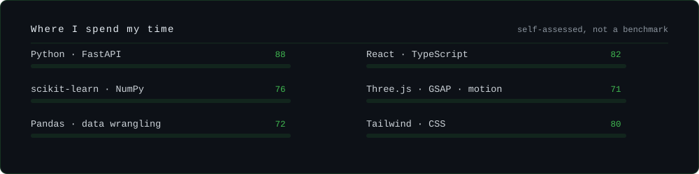

## About

I build simulators and ML tools, and the interfaces that make them usable. Mostly Python
for the modelling, React and Three.js when something needs to be looked at.

What I care about is honest measurement — a model that reports when it loses to the
baseline is worth more than one that only reports its wins.

## Tech Stack

#### Languages

    

#### ML &amp; Data

     

#### Web

     

#### Tooling

     

## Projects

| Project | What it does | Built with |
|:--------|:-------------|:-----------|
| **[apex-f1](https://github.com/Suhas29wasnotavailable/apex-f1)** | A digital twin of an F1 race. Tests whether reinforcement learning actually beats dynamic programming for race strategy — and publishes the result when it doesn't. | `Python` `NumPy` `Polars` |
| **[CodePatternAnalyzer](https://github.com/Suhas29wasnotavailable/CodePatternAnalyzer)** · [demo](https://code-pattern-analyzer.vercel.app) | Works out who wrote a Python file from style alone — AST structure paired with character n-grams through an MLP classifier. | `Python` `scikit-learn` `FastAPI` |
| **[portfolio](https://github.com/Suhas29wasnotavailable/portfolio)** · [live](https://suhasy.vercel.app) | My personal site — motion, smooth scroll, a WebGL scene, built to stay fast. | `React` `Three.js` `GSAP` |
| **[gauri-khetan-portfolio](https://github.com/Suhas29wasnotavailable/gauri-khetan-portfolio)** · [live](https://gauri-khetan.vercel.app) | Portfolio site built for a product and brand designer. | `JavaScript` `CSS` |

<b>&nbsp;How I work</b>

 

| | |
|:--|:--|
| **Editor** | Neovim |
| **Terminal** | Ghostty · tmux · zsh |
| **Machine** | macOS day to day, Linux for anything that matters |
| **Python** | uv, ruff, mypy, pytest — set up before the first feature, not after |

- Most ML problems are data problems wearing a trench coat.
- If your eval set was built after your model, it isn't an eval set.
- Notebooks are for thinking, not for shipping.
- A result that disproves your own thesis is still a result worth publishing.

## GitHub

<a href="https://suhasy.vercel.app">suhasy.vercel.app</a> &nbsp;·&nbsp; <a href="mailto:ys.suhas29@gmail.com">ys.suhas29@gmail.com</a>

